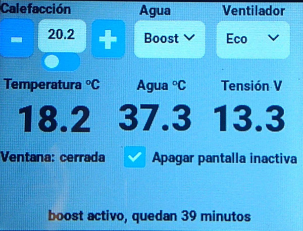

# CYD display for a truma combi D

It's a simple project to display and control a truma combi D with a [Cheap
Yellow Display](https://github.com/witnessmenow/ESP32-Cheap-Yellow-Display).

It's an mqtt client using the topics made available by
[TruMinus](https://github.com/olivluca/TruMinus) and uses the
[esp32-smartdisplay](https://github.com/rzeldent/esp32-smartdisplay)
library.

The UI has been generated with [Squareline studio](https://squareline.io/).

This software is not provided, endorsed, supported, or sponsored by Truma. It may or may not be working with their products. 
Please read the [license file](LICENSE), in particular:

IN NO EVENT UNLESS REQUIRED BY APPLICABLE LAW OR AGREED TO IN WRITING WILL ANY COPYRIGHT HOLDER,
OR ANY OTHER PARTY WHO MODIFIES AND/OR CONVEYS THE PROGRAM AS PERMITTED ABOVE, BE LIABLE TO YOU FOR DAMAGES,
INCLUDING ANY GENERAL, SPECIAL, INCIDENTAL OR CONSEQUENTIAL DAMAGES ARISING OUT OF THE USE OR INABILITY TO
USE THE PROGRAM.
